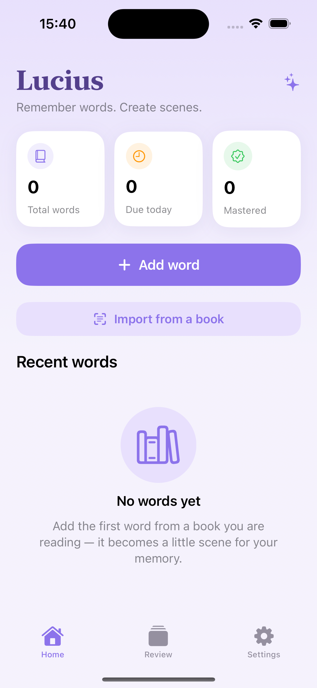

# Lucius

**Remember words. Create scenes.**

Lucius is an iOS vocabulary app for language learners who read. Instead of drilling flat flashcards, it turns each word into a small **visual memory scene** — an AI‑generated illustration paired with the sentence you found it in — and resurfaces it with spaced repetition right when you're about to forget.

<p align="center">
  
</p>

> Built with SwiftUI + SwiftData, targeting iOS 17+.

---

## Features

- **Flip‑and‑swipe review.** Cards flip in 3D to reveal the answer, then swipe like a flashcard — ← forgot, → I know it, ↑ almost — with haptics and a fling animation. Answer buttons remain as the accessible path.
- **Spaced repetition.** A small, transparent scheduler (`ReviewScheduler`) promotes words through *new → learning → familiar → mastered* and schedules the next review (30 min → 6 h → 1 day → 7 days → 30 days).
- **AI memory scenes.** Generate an illustration for any word — on‑device via **Image Playground** (Apple Intelligence) where available, or the free, crowdsourced **AI Horde** network everywhere else.
- **Import from a book.** Paste a passage or snap a photo of a page; on‑device **Vision** OCR extracts the text, Lucius surfaces the words worth learning, auto‑translates the ones you pick, and schedules them all at once.
- **Progress that feels alive.** A mastery ring and a GitHub‑style activity heatmap with a day streak, plus a confetti celebration the moment a word is mastered.
- **Home & Lock Screen widgets.** A WidgetKit extension shows how many words are due and your streak, and recomputes "due" over time from shared review dates — no app launch needed. Tap to deep‑link straight into a review.
- **Siri & Shortcuts.** App Intents let you add a word hands‑free ("Add a word to Lucius") from Siri, Spotlight or the Shortcuts app.
- **Pronunciation & translation.** Built‑in speech synthesis and one‑tap translation (system Translation framework on iOS 18+, free network fallback below).
- **Gentle reminders.** Local notifications fire exactly when a word is due.

## Tech stack

| Area | Choice |
| --- | --- |
| UI | SwiftUI, `@Observable` view models (MVVM) |
| Persistence | SwiftData (`@Model`, external‑storage image blobs) |
| Widgets | WidgetKit (Home + Lock Screen), App Group–shared snapshot |
| Voice / automation | App Intents + App Shortcuts (Siri, Spotlight) |
| OCR | Vision (`VNRecognizeTextRequest`) |
| Image generation | Image Playground (on‑device) + AI Horde (network fallback) |
| Translation | Translation framework (iOS 18+) + MyMemory (fallback, cached) |
| Speech | `AVSpeechSynthesizer` |
| Secrets | Keychain (`KeychainStore`) |
| Tests | Swift Testing |
| Project gen | XcodeGen (`project.yml`) |
| Linting | SwiftLint (`.swiftlint.yml`) |

## Architecture

```
Lucius/
├── App/            App entry point, ModelContainer factory, AppRouter, App Intents
├── Models/         SwiftData @Model types + enums (VocabularyWord, ReviewEvent, …)
├── ViewModels/     @Observable @MainActor view models
├── Services/       Stateless services & singletons (scheduler, OCR, translation,
│                   image generation, notifications, keychain, haptics, widget sync)
├── Shared/         Code compiled into both the app and the widget (review snapshot)
└── Views/          Screens + a reusable Components/ design system
    └── Components/  Theme tokens, buttons, cards, heatmap, celebration, …
LuciusWidget/       WidgetKit extension (Home + Lock Screen)
LuciusTests/        Swift Testing unit tests
```

A few deliberate choices:

- **Pure core, thin shell.** Logic that's worth trusting — the review scheduler, word extraction, the heatmap/streak math, import stats — lives in pure, `now`‑injectable functions so it can be unit‑tested without spinning up SwiftData or a simulator clock.
- **Design tokens.** Spacing, corner radius, typography, elevation and color all live in `Theme.swift`; views compose tokens instead of magic numbers.
- **Detached image generation.** `SceneImageGenerationManager` owns generation app‑wide, so leaving a screen doesn't cancel a request and the result is written back the moment it lands.
- **Accessibility.** Dynamic Type–aware fonts, VoiceOver labels/values on cards, badges and images, and swipe gestures backed by equivalent buttons.

## Getting started

### Prerequisites

- Xcode 16+ (uses Swift Testing and SwiftData)
- [XcodeGen](https://github.com/yonsk/XcodeGen) — `brew install xcodegen`
- [SwiftLint](https://github.com/realm/SwiftLint) (optional) — `brew install swiftlint`

### Build & run

```bash
# Generate the Xcode project from project.yml (it is git‑ignored)
xcodegen generate

# Open and run, or build from the CLI:
xcodebuild -scheme Lucius -destination 'platform=iOS Simulator,name=iPhone 16' build
```

The `.xcodeproj` is generated and **not** checked in — `project.yml` is the single source of truth. Always run `xcodegen generate` after pulling.

### Test

```bash
xcodebuild -scheme Lucius -destination 'platform=iOS Simulator,name=iPhone 16' test
```

### Lint

```bash
swiftlint lint --strict
```

## Image generation & keys

Scene images use **Image Playground** on Apple‑Intelligence devices automatically. Elsewhere, Lucius falls back to **AI Horde**, which works anonymously (slowest queue) or faster with a free personal key. Add a key in **Settings → Image generation**; it's stored in the Keychain, never in plain preferences. Get one at [aihorde.net](https://aihorde.net/register).

## Roadmap

- FSRS / SM‑2 style adaptive scheduling with per‑word ease factors
- Full‑screen, parallax "hero scene" review mode
- iCloud sync across devices
- In‑place editing of imported words

## License

Released under the MIT License — see [LICENSE](LICENSE).
